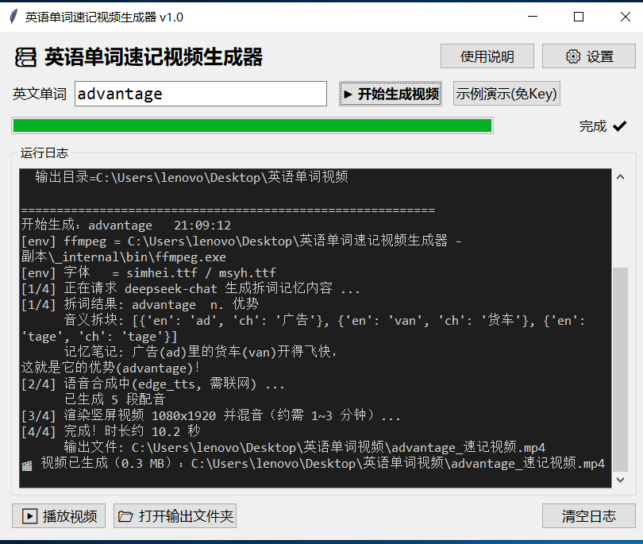
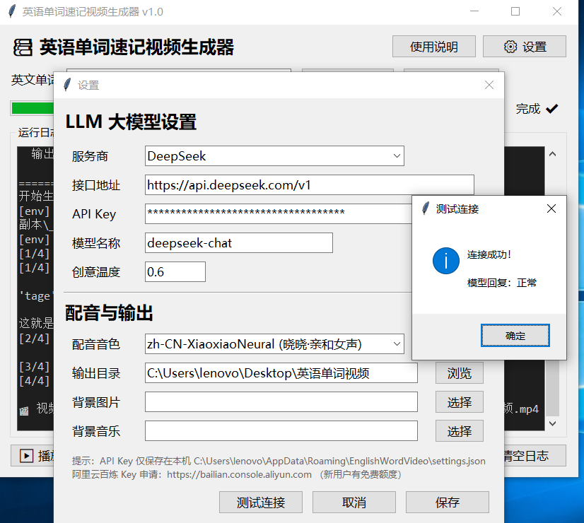

# 🎬 英语单词速记视频生成器

> 输入一个英文单词，自动生成「**音义拆解 + 趣味笔记 + 真人配音**」的竖屏短视频（1080×1920 MP4）。
> 由 [Coze 工作流](https://www.coze.com)「英语单词速记视频」转换而来，完全本地可运行。




## ✨ 功能特点

| 特性 | 说明 |
|---|---|
| **AI 拆词** | LLM 智能拆解词根词缀，生成音义对应记忆块 |
| **趣味笔记** | 「梗式」中文创意笔记（本土化、有共鸣、可传播） |
| **真人配音** | 微软 Edge TTS，7 种音色可选（含东北话/陕西话等方言） |
| **竖屏输出** | 1080×1920，直接发布抖音 / 视频号 / B站 |
| **多模型支持** | 阿里百炼 / OpenAI / DeepSeek / 智谱 GLM / 自定义 |
| **免 Key 演示** | 内置示例词，无需 API Key 即可看完整效果 |

## 📦 打包成品（推荐）

已打包为 **Windows 绿色软件**，双击即用，无需安装 Python / ffmpeg：

| 方式 | 链接 |
|---|---|
| **夸克网盘下载**（59MB zip） | https://pan.quark.cn/s/4233ae6a6756 |
| GitHub Releases | 见 [Releases](../../releases) 页面 |

> 解压后整个文件夹一起复制，双击 `英语单词速记视频生成器.exe` 或 `双击启动.bat` 即可运行。
> 首次使用点右上角 ⚙ 设置，填入大模型 API Key（[阿里百炼新用户免费额度](https://bailian.console.aliyun.com)）。

## 🎬 DEMO 视频

以下是用本工具生成的实际效果：

### 示例 1：aftermath（创伤）
> 拆解：after（之后）+ math（数学）→ 学了数学之后，心灵受到了创伤

[demo/aftermath_速记视频.mp4](demo/aftermath_速记视频.mp4)

### 示例 2：advantage（优势/优点）
> 拆解：ad（广告）+ van（货车）+ tage（标签）→ 广告(ad)里的货车(van)开得飞快，这就是它的优势(advantage)！

[demo/advantage_速记视频.mp4](demo/advantage_速记视频.mp4)

## 🔧 技能版（开发者 / WorkBuddy 用户）

如果你是 **WorkBuddy** 用户，可直接安装此技能使用命令行版本：

```
# 安装技能到 ~/.workbuddy/skills/
# （WorkBuddy 内置 find-skills 安装流程）
```

### 依赖

```txt
edge_tts>=1.0
pillow>=10.0
numpy>=1.24
requests>=2.28
websocket-client>=1.0   # 同步 TTS（替代 aiohttp）
mutagen>=1.47          # 音频时长检测
```

系统还需：
- **ffmpeg**（视频编码）
- **Python 3.11+**
- 中文字体（simhei / 微软雅黑）

### 命令行用法

```bash
# 用内置示例跑通全流程（无需 API Key）
python gen_word_video.py --demo

# 生成指定单词的视频
python gen_word_video.py --word aftermath
python gen_word_video.py --word advantage --voice zh-CN-XiaoxiaoNeural
python gen_word_video.py --word economy --bg-image bg.png --bgm music.mp3
```

### 视频结构（三段式）

1. **开场拆解段** — 大号单词 + 词性释义 + 音义拆块错落淡入
2. **笔记段** — LLM 生成的创意笔记，淡入上飘动画
3. **结尾强化段** — 单词再次淡入淡出，「记住它！」强化记忆

人声顺序：`单词 → 中文释义 → 笔记 → 单词 → 中文释义`

## 🏗️ 架构

```
输入单词
  → LLM (DashScope/OpenAI/DeepSeek/...)  拆词 + 生成记忆笔记
  → Edge TTS (微软在线语音)               合成 5 段配音
  → PIL 逐帧渲染 (1080x1920)              三段式动画字幕
  → ffmpeg 编码混音                       输出成品 MP4
```

## 📄 配置

首次运行自动生成 `config.json`：

```json
{
  "llm": {
    "provider": "dashscope",
    "base_url": "https://dashscope.aliyuncs.com/compatible-mode/v1",
    "api_key": "YOUR_KEY",
    "model": "qwen-plus",
    "temperature": 0.6
  },
  "tts": { "voice": "zh-CN-YunxiNeural" },
  "video": { "width": 1080, "height": 1920, "fps": 30 }
}
```

支持的环境变量覆盖：`DASHSCOPE_API_KEY` / `OPENAI_API_KEY`

## 📜 License

MIT License

---

> 💡 本项目由 [Coze 工作流](https://www.coze.com)「英语单词速记视频」逆向解析转换而来，
> 保留原工作流的 LLM prompt 核心逻辑，改用开源工具链实现完全本地化运行。
